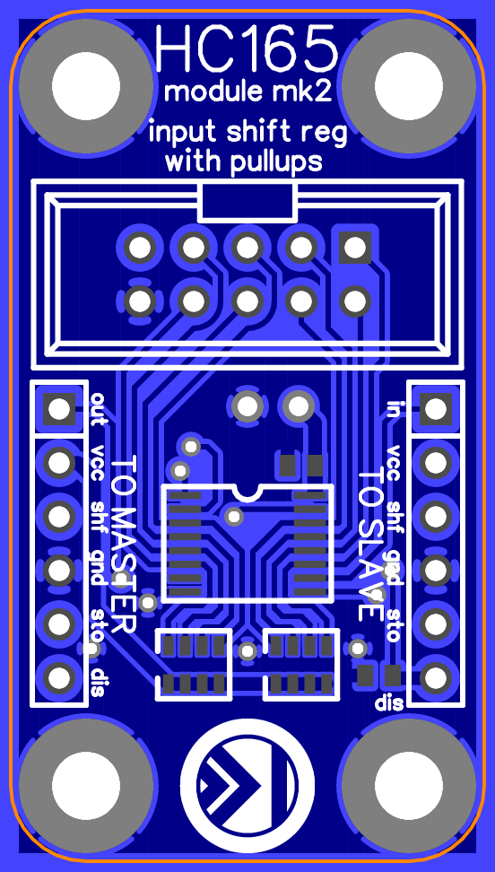

74HC165PW (TSSOP16) PISO shift register augmented breakout
==========================================================

This is a design for an augmented breakout for a 74HC165PW parallel-in/serial-out 8-bit shift register in a TSSOP-16 package.

Features
--------

*   Decoupling capacitor on board.
*   Pull-up resistors on board for all 8 inputs.
*   Optional pull-down resistor for clock disable line.
*   10-pin boxed header provides connection to all 8 input pins, plus supply and ground.
*   The host-side 6-pin header provides power and serial input to the board, while the compatible guest-side 6-pin header provides power and serial output to the host-side header of another breakout (or to another 74HC165-based or similar assembly).
*   Pre-fab and some-assembly-required options for cables for the header connectors are readily available.

Parts list
----------

*   1 × 74HC165PW (TSSOP-16)
*   2 × 6-pin header (100-mil centers)
*   1 × 10-pin boxed header (100-mil centers)
*   1 × 0.1µF capacitor (0603)
*   1 × 10kΩ (nom.) resistor (0603)
    *   This is a pull-down resistor for the clock disable (aka "clock inhibit", "/CE", "clock enable (active-low)", etc.) input.
    *   Including this resistor allows the module to default to enabled when the pin is not driven. If this pin will instead always be driven with an HC-compatible signal, this resistor may be omitted.
*   2 × 10kΩ (nom.) isolated 4-resistor array (0612, aka 0603 x 4)
    *   These are pull-up resistors for the 8 signal inputs.
    *   Including these resistors allows the module to accept inputs from switches. If the inputs will instead be driven with HC-compatible signals, these resistors may be omitted.

License
-------

> Designed 2016-2017 by Peter S. May (http://psmay.com/).
>
> To the extent possible under law, the author(s) have dedicated all copyright and related and neighboring rights to these design and layout documents to the public domain worldwide. This content is distributed without any warranty.
>
> You should have received a copy of the CC0 Public Domain Dedication along with this software. If not, see http://creativecommons.org/publicdomain/zero/1.0/.
